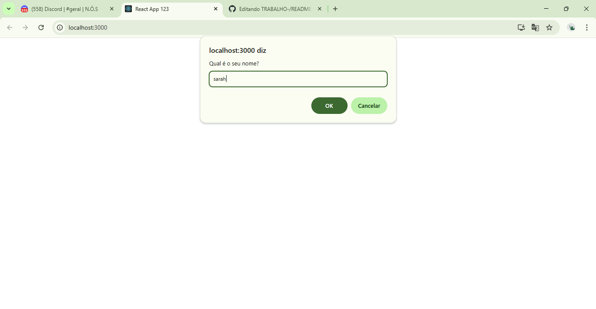

# 📘 Projeto React 

Este projeto foi desenvolvido com foco em praticar os conceitos fundamentais de React, incluindo uso de componentes, manipulação de estados com `useState`, efeitos colaterais com `useEffect`, renderização de listas com `map`, uso de formulários e persistência de dados utilizando `localStorage`.

## 🎯 Funcionalidades

- Formulário para cadastro de tarefas.
- Renderização dinâmica de tarefas em lista.
- Armazenamento das tarefas no `localStorage`.
- Persistência das tarefas mesmo após recarregar ou fechar a página.
- Cadastro e exibição do nome do usuário.
- Personalização do fundo da página com base na cor escolhida pelo usuário.

## 🚀 Tecnologias Utilizadas

- React
- JavaScript (ES6+)
- HTML5
- CSS3

## 🧠 Conceitos Praticados

- Componentes funcionais
- Estados com `useState`
- Efeitos com `useEffect`
- Manipulação de arrays
- Eventos de formulário
- Persistência local com `localStorage`
- Uso de `key` em listas dinâmicas
- Personalização de interface

## 🛠️ Como Rodar o Projeto

1. Clone este repositório:
   ```bash
   git clone https://github.com/seu-usuario/seu-repo.git
   ```

2. Acesse a pasta do projeto:
   ```bash
   cd seu-repo
   ```

3. Instale as dependências:
   ```bash
   npm install
   ```

4. Inicie o servidor de desenvolvimento:
   ```bash
   npm start
   ```

5. Acesse no navegador:
   ```
   http://localhost:3000
   ```

```

## 📸 Preview



